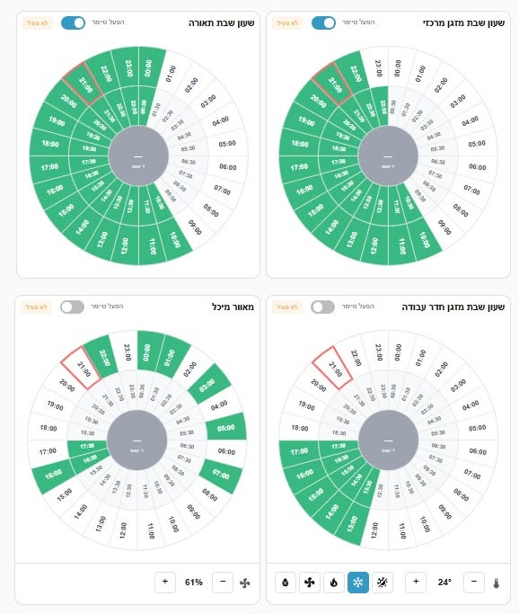
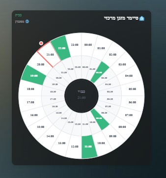

# Timer 24H for Home Assistant

Timer 24H is a Home Assistant custom integration with a visual 24-hour Lovelace card. It lets you tap half-hour segments on a circular clock to set a daily schedule, then turns entities on or off according to that schedule and optional activation conditions.


[](https://hacs.xyz/)
[](https://github.com/davidss20/home-assistant-24h-timer-integration/releases)
[](LICENSE)
[](https://buymeacoffee.com/davidss20)

## Demo / Screenshots




*24-hour circular timer with automatic entity control and optional activation conditions*

Home Assistant scheduling can become cumbersome when you want to change a recurring daily schedule quickly. Timer 24H gives that schedule a visual 24-hour interface instead of a stack of automations.

## Features

- 24-hour circular timer with 30-minute segments
- Automatic control of lights, switches, fans, climate, covers, and similar entities
- Optional activation conditions (presence, Shabbat mode, vacation, or any on/off sensor)
- Multiple timer instances
- Schedule and enabled-state persistence across restarts
- Multi-language UI, including Hebrew RTL
- Lovelace card installed and registered automatically with cache busting

## Tech Stack

- **Python** — Home Assistant custom integration (Config Flow, DataUpdateCoordinator, sensor entity, services)
- **TypeScript + Lit** — Lovelace custom card
- **HACS** — distribution as a custom integration repository

## Architecture

The Python integration owns the schedule and entity control. The card is a UI over a `sensor.timer_24h_*` entity: it reads `time_slots` and related attributes, then calls integration services such as `timer_24h.toggle_slot`.

See [docs/ARCHITECTURE.md](docs/ARCHITECTURE.md) for a concise component map.

## Installation

### Via HACS (recommended)

This integration is installed as a **custom repository** (it is not in the HACS default store).

1. Open **HACS**
2. Go to **Integrations**
3. Open the three-dot menu → **Custom repositories**
4. Add:
   - **Repository:** `https://github.com/davidss20/home-assistant-24h-timer-integration`
   - **Category:** Integration
5. Search for **Timer 24H**, install it, then **restart Home Assistant**
6. Add the integration: **Settings → Devices & Services → Add Integration → Timer 24H**

The Lovelace resource is registered automatically. If that fails, add a JavaScript module resource:

`/local/timer-24h-card/timer-24h-card.js`

### Manual installation

1. Download the latest release from [GitHub Releases](https://github.com/davidss20/home-assistant-24h-timer-integration/releases)
2. Copy `custom_components/timer_24h` into your Home Assistant `config/custom_components/` directory
3. Restart Home Assistant
4. Add the integration from **Settings → Devices & Services**

The integration copies the card to `www/timer-24h-card/` and updates the Lovelace resource URL with a `?v=` cache-busting parameter on version changes.

## Usage

1. **Settings → Devices & Services → Add Integration → Timer 24H**
2. Set a name, optional entities to control, and optional activation-condition sensors (OR/AND)
3. On a dashboard, add **Timer 24H Card** and select the timer entity

YAML example:

```yaml
type: custom:timer-24h-card
entity: sensor.timer_24h_lighting
show_title: true
```

Tap outer-ring segments for full hours (`00:00`, `01:00`, …) and inner-ring segments for half hours (`00:30`, `01:30`, …).

- **Green** — active slot
- **Gray** — inactive slot
- **Blue border** — current slot
- **Green center** — activation conditions met
- **Yellow center** — conditions not met

More automations and templates: [docs/examples.md](docs/examples.md)

### Configuration

| Name | Type | Required | Description |
|------|------|----------|-------------|
| `name` | string | yes | Timer name |
| `entities` | list | no | Entities to control automatically |
| `home_sensors` | list | no | Activation-condition sensors |
| `home_logic` | string | no | `OR` or `AND` |

Card options: `entity` (required), `show_title` (default `true`), `custom_title`, `show_enable_switch`.

Supported control domains include `light`, `switch`, `fan`, `climate`, `media_player`, `cover`, `input_boolean`, and `group`. Condition sensors include `person`, `device_tracker`, `binary_sensor`, `sensor`, and `input_boolean`.

### Services

`timer_24h.toggle_slot`, `timer_24h.set_slots`, `timer_24h.clear_all`, and `timer_24h.set_enabled`.

```yaml
service: timer_24h.toggle_slot
data:
  entity_id: sensor.timer_24h_lighting
  hour: 14
  minute: 30
```

The sensor states are `active`, `idle`, and `blocked`. Useful attributes: `time_slots`, `current_slot`, `home_status`, `controlled_entities`, `enabled`.

## Development

```bash
npm install
npm run build
```

This compiles `src/timer-24h-card.ts` and `src/timer-24h-card-editor.ts` into `custom_components/timer_24h/dist/`, which is the path Home Assistant copies to `www/timer-24h-card/`.

Watch mode: `npm run dev`

Helper scripts (optional): `scripts/build.ps1`, `scripts/install.ps1`, `scripts/build_and_install.py`

Local card previews (no Home Assistant): `docs/preview/preview.html`

## Contributing

Issues and pull requests are welcome. Please keep changes focused, do not commit `node_modules` or secrets, and run `npm run build` if you touch the Lovelace card.

## License

MIT. See [LICENSE](LICENSE).

---

[Buy Me A Coffee](https://buymeacoffee.com/davidss20) · [Issues](https://github.com/davidss20/home-assistant-24h-timer-integration/issues) · [Discussions](https://github.com/davidss20/home-assistant-24h-timer-integration/discussions)
